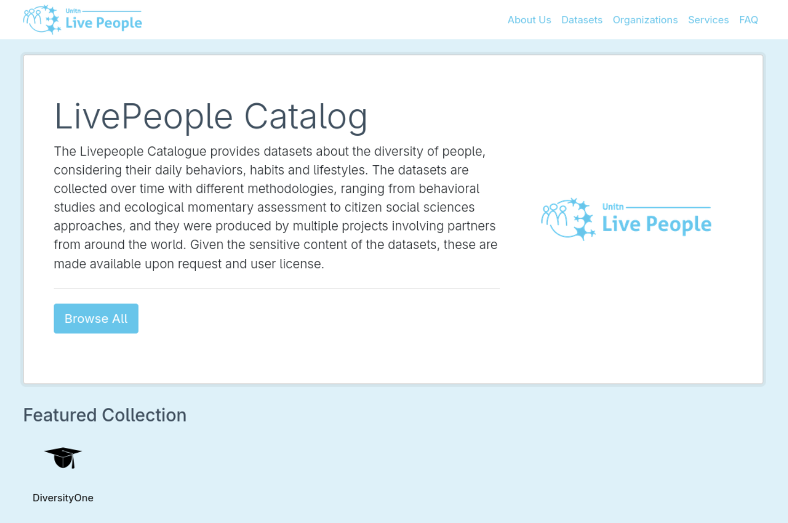
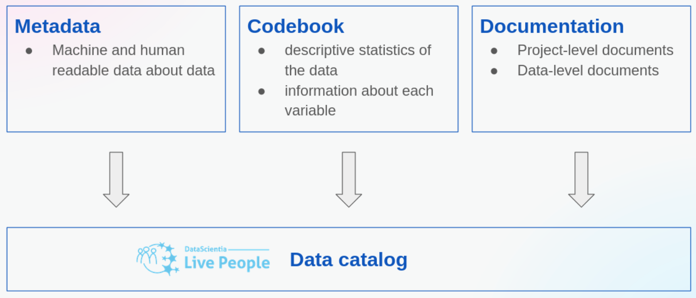

The [LivePeople Catalog](https://livepeople.datascientia.eu/) provides datasets about the diversity of people, considering their daily behaviors, habits and lifestyles. The datasets are collected over time with different methodologies, ranging from behavioral studies and ecological momentary assessment to citizen social sciences approaches, and they were produced by multiple projects involving partners from around the world. Given the sensitive content of the datasets, these are made available upon request and user license. 

{width=60% fig-align="center" fig-alt="LivePeople website."}

## Documentation

{width=75% fig-align="center"}

To allow data consumers to discover which data are available and understand if it fits their purposes, each dataset is described by:

- _[metadata](metadata.qmd)_ describes the data and the project that generated it;
- _documentation_ details the project and the data;
- _codebook_ shows data descriptive statistics for each dataset variable ([codebook example](https://datascientiafoundation.github.io/LivePeople-Documentation/codebooks/2020_DV1_Amrita_accelerometer.html) for the accelerometer sensor).

## Dataset organization

- **_basic Datasets_** are the basic units which contain the data from a single measurement instrument, such as [accelerometer](https://datascientiafoundation.github.io/LivePeople/datasets/2020-DiversityOne-Trento-Accelerometer/) or step counter (e.g., `2018-SU2-Trento-Accelerometer`). The name format is `<year>-<acronym for the data collection experiment>-<data collection location>-<dataset name>` of the sensor or measure instrument>.
- **_Bundles_** are groups of basic datasets that can be classified as part of the same category or that are typically used together. For example, [motion sensors](https://datascientiafoundation.github.io/LivePeople/datasets/2020-DiversityOne-Copenhagen-Motion/) groups accelerometer and step counter. The bundle metadata lists the contained datasets.
- **_Project_** is a data collection study carried out in one location, such as 2018-Smart Unitn 2-Trento. It contains all the datasets collected during the study.

All these three types can be requested. Selecting a bundle or a project means that all the datasets that are contained are also selected.